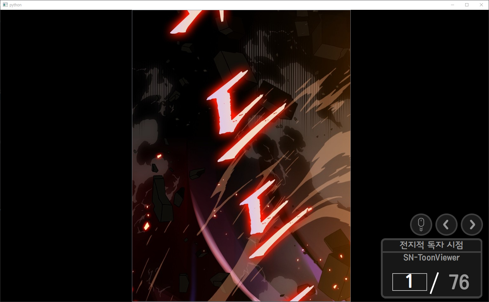

# SN-ToonViewer (Incomplete)

## requirements

* beautifulsoup4==4.10.0
* bs4==0.0.1
* certifi==2021.10.8
* charset-normalizer==2.0.7
* idna==3.3
* numpy==1.21.3
* opencv-python==4.5.4.58
* PyQt5==5.15.5
* PyQt5-Qt5==5.15.2
* PyQt5-sip==12.9.0
* requests==2.26.0
* soupsieve==2.2.1
* urllib3==1.26.7
* wincertstore==0.2

## Usage

```python
pip install -r requrements.txt
python MainWindow.py
```

## Features
* Automatically continue next episode without interruption.
* Auto scroll

## TODO
1. 커밋 정리
2. venv 제거
3. 전체화면 기능 추가
4. readme 제대로 작성